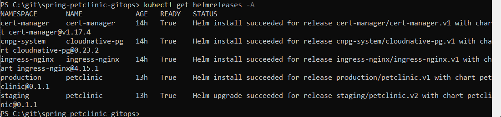
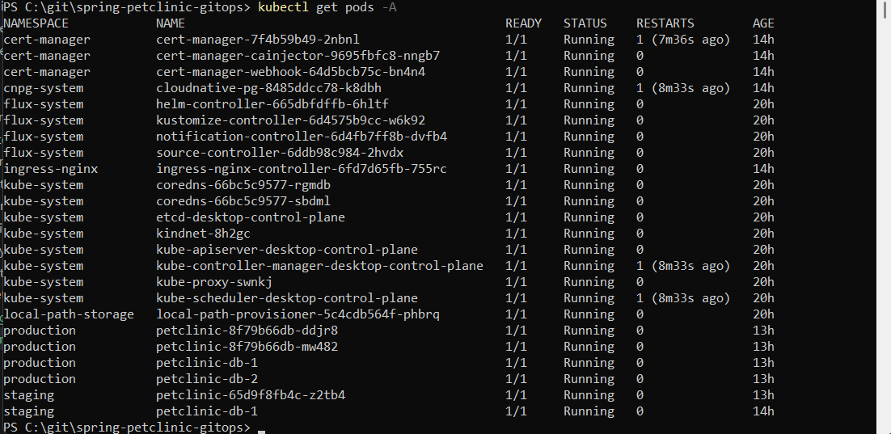
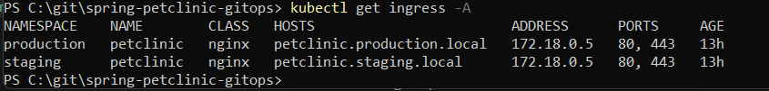

# 🚀 Spring PetClinic GitOps Platform

Production-like Kubernetes platform built with:


---

# 📖 Overview

This project demonstrates a complete GitOps-based Kubernetes platform using:

- Spring PetClinic
- FluxCD GitOps
- Helm charts
- CloudNativePG PostgreSQL Operator
- ingress-nginx
- cert-manager
- HTTPS/TLS
- Horizontal Pod Autoscaling
- Multi-environment deployments

---

# 🏗 Architecture

```text
                   +----------------------+
                   |      GitHub Repo     |
                   |   GitOps Manifests   |
                   +----------+-----------+
                              |
                              v
                   +----------------------+
                   |        FluxCD        |
                   |  GitOps Controller   |
                   +----------+-----------+
                              |
         --------------------------------------------
         |                    |                     |
         v                    v                     v

+----------------+   +----------------+   +----------------+
| ingress-nginx  |   | cert-manager   |   | CloudNativePG |
+----------------+   +----------------+   +----------------+
                                                   |
                                                   v
                                        +-------------------+
                                        | PostgreSQL Cluster|
                                        +-------------------+

                              |
                              v

                   +----------------------+
                   | Spring PetClinic App |
                   +----------------------+
```

---

# ✨ Features

## ✅ GitOps

- FluxCD bootstrap
- GitRepository
- Kustomizations
- HelmRelease resources
- Git-driven deployments

---

## ✅ Kubernetes Infrastructure

### ingress-nginx

Used as Kubernetes Ingress Controller.

### cert-manager

Used for automatic TLS certificate management.

### CloudNativePG

Production-grade PostgreSQL Operator for Kubernetes.

---

## ✅ Application

Spring PetClinic deployed using a custom Helm chart.

---

## ✅ Multi-Environment Setup

### staging

- 1 replica
- minimal resources
- single PostgreSQL instance

### production

- HPA enabled
- CPU + Memory autoscaling
- PostgreSQL HA setup
- resource limits
- HTTPS enabled

---

# 📁 Repository Structure

```text
spring-petclinic-gitops/
├── apps/
│   ├── staging/
│   └── production/
│
├── charts/
│   └── petclinic/
│
├── infrastructure/
│   ├── ingress-nginx/
│   ├── cert-manager/
│   └── cloudnative-pg/
│
└── clusters/
    └── my-cluster/
```

---

# ⚡ FluxCD Bootstrap

```bash
flux bootstrap github \
  --owner=Monah0 \
  --repository=spring-petclinic-gitops \
  --branch=main \
  --path=clusters/my-cluster \
  --personal
```

---

# 🐳 Docker Image

Docker image is built using a multi-stage Dockerfile.

```dockerfile
FROM maven:3.9-eclipse-temurin-17 AS build

WORKDIR /app

COPY . .

RUN mvn clean package -DskipTests

FROM eclipse-temurin:17-jre

WORKDIR /app

COPY --from=build /app/target/*.jar app.jar

EXPOSE 8080

ENTRYPOINT ["java","-jar","app.jar"]
```

---

# ☸️ Infrastructure Deployment

## ingress-nginx

```bash
flux reconcile kustomization ingress-nginx -n flux-system
```

---

## cert-manager

```bash
flux reconcile kustomization cert-manager -n flux-system
```

---

## CloudNativePG

```bash
flux reconcile kustomization cloudnative-pg -n flux-system
```

---

# 🚀 Application Deployment

## staging

```bash
flux reconcile kustomization petclinic-staging -n flux-system
```

---

## production

```bash
flux reconcile kustomization petclinic-production -n flux-system
```

---

# 🔐 HTTPS / TLS

HTTPS is implemented using:

- cert-manager
- self-signed ClusterIssuer
- ingress TLS configuration

---

# 📈 Horizontal Pod Autoscaler

Production environment uses:

- CPU autoscaling
- Memory autoscaling

```yaml
minReplicas: 2
maxReplicas: 5
```

---

# 🗄 PostgreSQL Operator

PostgreSQL is managed using CloudNativePG Operator.

Example Cluster resource:

```yaml
apiVersion: postgresql.cnpg.io/v1
kind: Cluster
```

---

# 🌐 Hosts File

Windows:

```text
127.0.0.1 petclinic.staging.local
127.0.0.1 petclinic.production.local
```

---

# 🔗 Access URLs

## Staging

```text
https://petclinic.staging.local
```

---

## Production

```text
https://petclinic.production.local
```

---

# 🔍 Verification

## Flux

```bash
flux get all
```

---

## Pods

```bash
kubectl get pods -A
```

---

## Ingress

```bash
kubectl get ingress -A
```

---

## Certificates

```bash
kubectl get certificate -A
```

---

# 📸 Screenshots

## Helm Releases

```bash
kubectl get helmreleases -A
```



---

## Kubernetes Pods

```bash
kubectl get pods -A
```



---

## Ingress Resources

```bash
kubectl get ingress -A
```



---

# 🛠 Technologies Used

- Kubernetes
- FluxCD
- Helm
- Docker
- Spring Boot
- PostgreSQL
- CloudNativePG
- ingress-nginx
- cert-manager
- GitHub Actions

---

# ✅ Result

This project demonstrates a production-like Kubernetes platform with:

- Infrastructure as Code
- GitOps delivery model
- Kubernetes Operators
- Helm package management
- HTTPS/TLS
- Autoscaling
- Multi-environment deployments
- PostgreSQL Operator-based database management
- Production-ready Kubernetes architecture

---